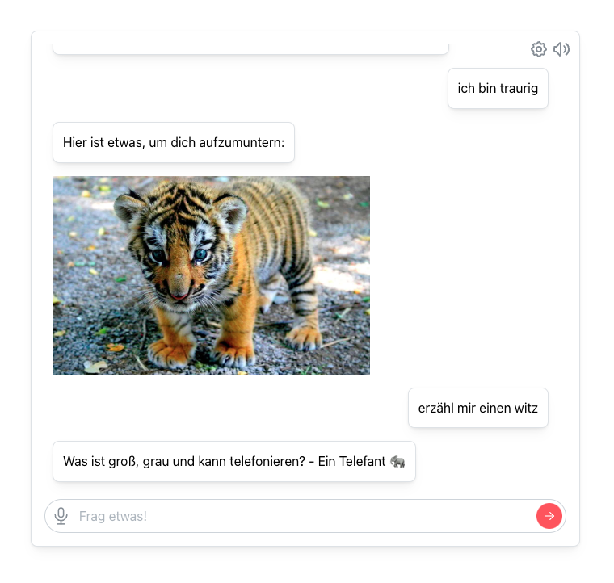

# react-rasa-chat-window

A react chat window for the [RASA](https://rasa.com/) conversational user interface framework build on [mantine](https://mantine.dev/) and [react-rasa-hook](https://github.com/Kevger/react-rasa-hook)





## 🙌 Features
- Works with the latest Rasa 3.x.
- Builds up on [Mantine](https://mantine.dev/).
- Optional [text to speech](https://developer.mozilla.org/en-US/docs/Web/API/SpeechSynthesis) and [speech to text](https://www.npmjs.com/package/react-speech-recognition).
- Darkmode and reponsive.

## 👷 Install
1) Clone/download the repo
2) npm install all dependencies using package.json or by hand
```
npm install 
```
or
```
npm install react @mantine/core react-rasa-hook react-speech-recognition @tabler/icons --save 
```
3) Customize the source code

## 🔧 How to use
The integration is simple, just import the chat window, add the server url and socket path.  
»onUtterance« can be used optionally as a callback in the case an utterance is made and some custom actions should be triggered.

```jsx
...
    <Chat
      onUtterance={(utterance) => console.log(utterance)}
      rasaServerUrl={"http://localhost:3000"}
      rasaSocketPath={"/socket.io/"}
    />
...
```

The dimensions will automatically adjust to the container. 
Customize the source code as you like.


## ⛓️ Dependencies
- "@mantine/core": "^5.7.2",
- "@tabler/icons": "^1.111.0",
- "react-rasa-hook": "^1.0.2",
- "react-speech-recognition": "^3.10.0"
